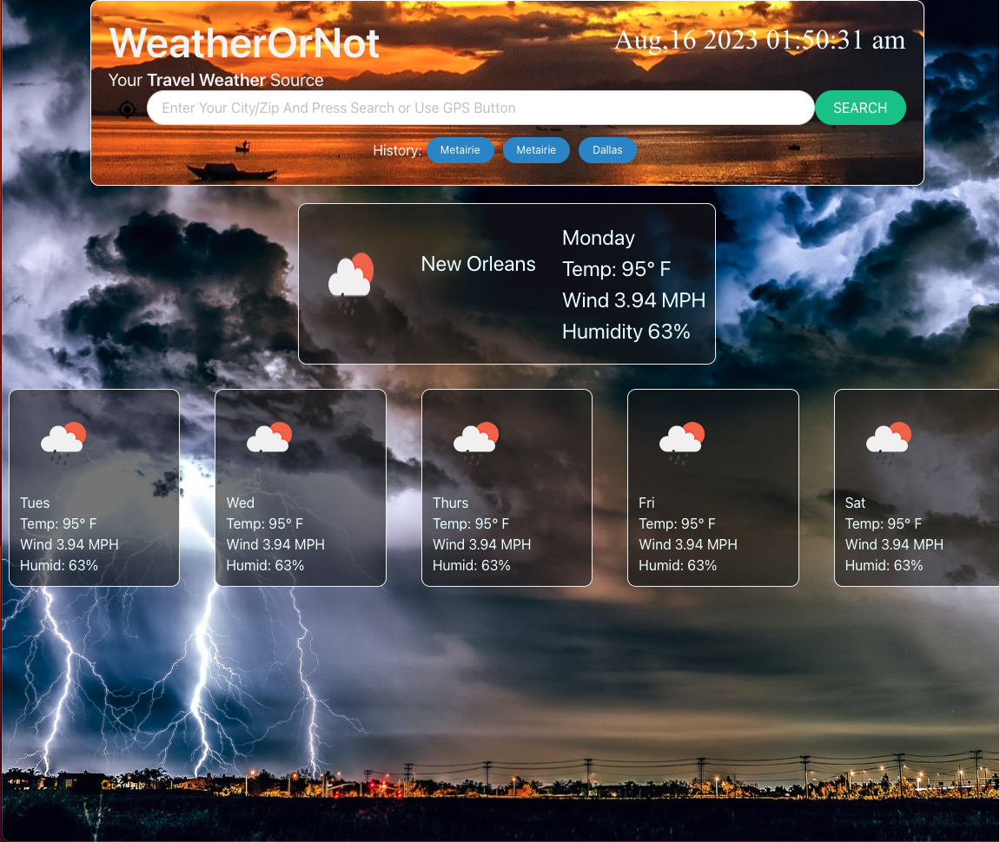

# weather_or_not

Certainly! Here's a README file for your HTML project:

# WeatherOrNot

Welcome to **WeatherOrNot**, your ultimate source for travel weather information. Plan your trips wisely and stay informed about the weather conditions using this web application.

## Features

- **Current Weather:** Instantly access real-time weather updates for your desired location.
- **5-Day Forecast:** Plan your week ahead with a 5-day weather forecast.
- **Location Detection:** Utilize GPS to get weather information for your current location.
- **Search:** Search for weather details by entering a city name or zip code.
- **History:** Keep track of your search history for easy reference.

## Table of Contents

- [Installation](#installation)
- [Usage](#usage)
- [Technologies](#technologies)
- [Contributing](#contributing)
- [License](#license)

## Usage

1. Upon opening the application, you'll be greeted with the main page showcasing the title and subtitle.
2. Click the GPS icon to fetch weather information based on your current location.
3. Alternatively, you can manually enter a city name or zip code in the input box and click the "SEARCH" button.
4. The main section of the page will display the current weather information, including temperature, wind speed, and humidity.
5. Scroll down to view the 5-day weather forecast, providing essential details for each day.

## Technologies

- HTML5
- CSS3 (Bulma framework)
- JavaScript (jQuery and Day.js)
- OpenWeatherMap API

## License

This project is licensed under the [MIT License](LICENSE).

---

Developed by Brandon Lumar (https://github.com/brlumar) | 

---

Stay weather-prepared with WeatherOrNot! 🌦️🌧️🌞

